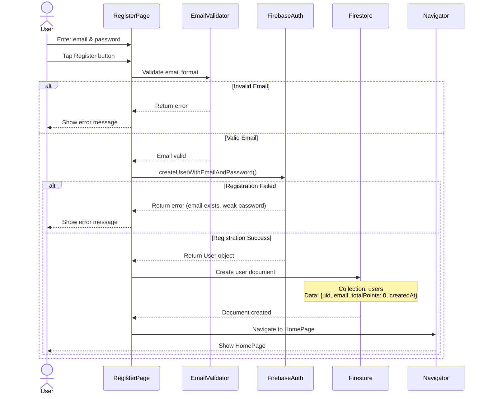
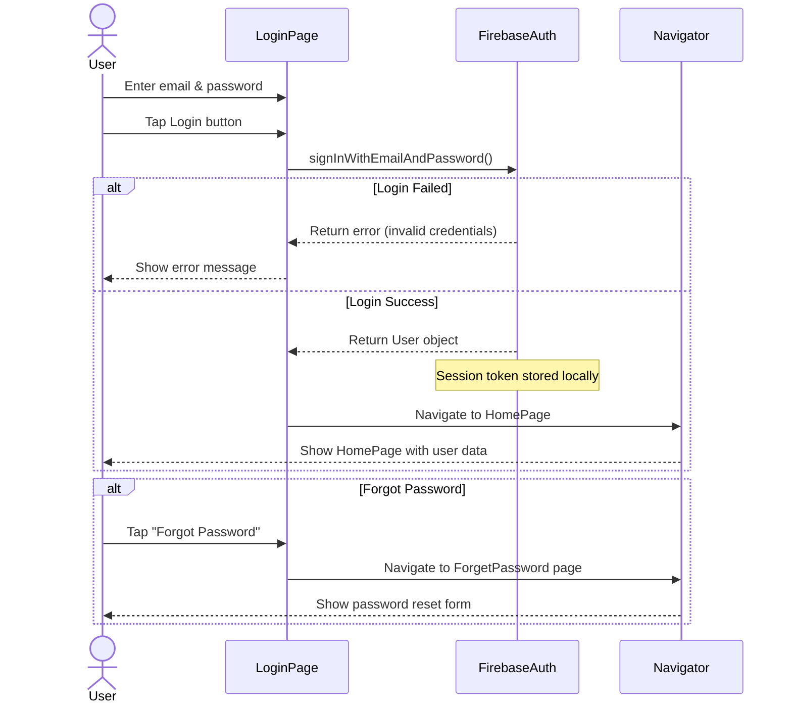
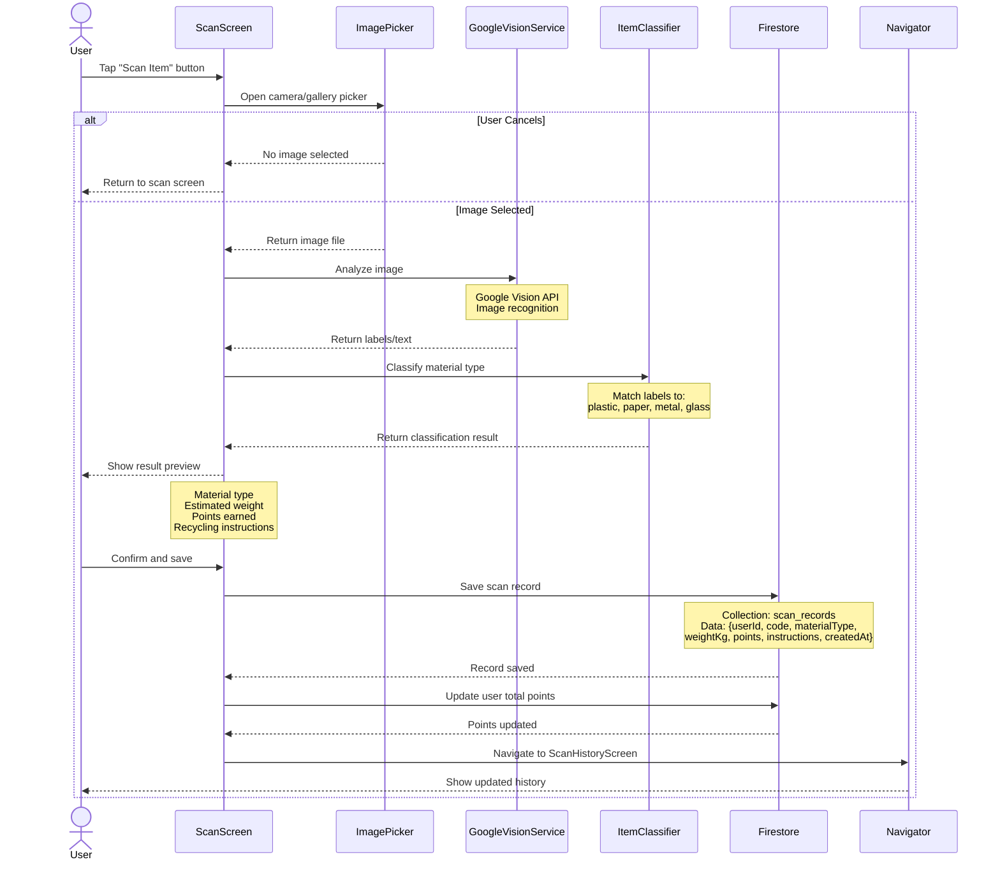
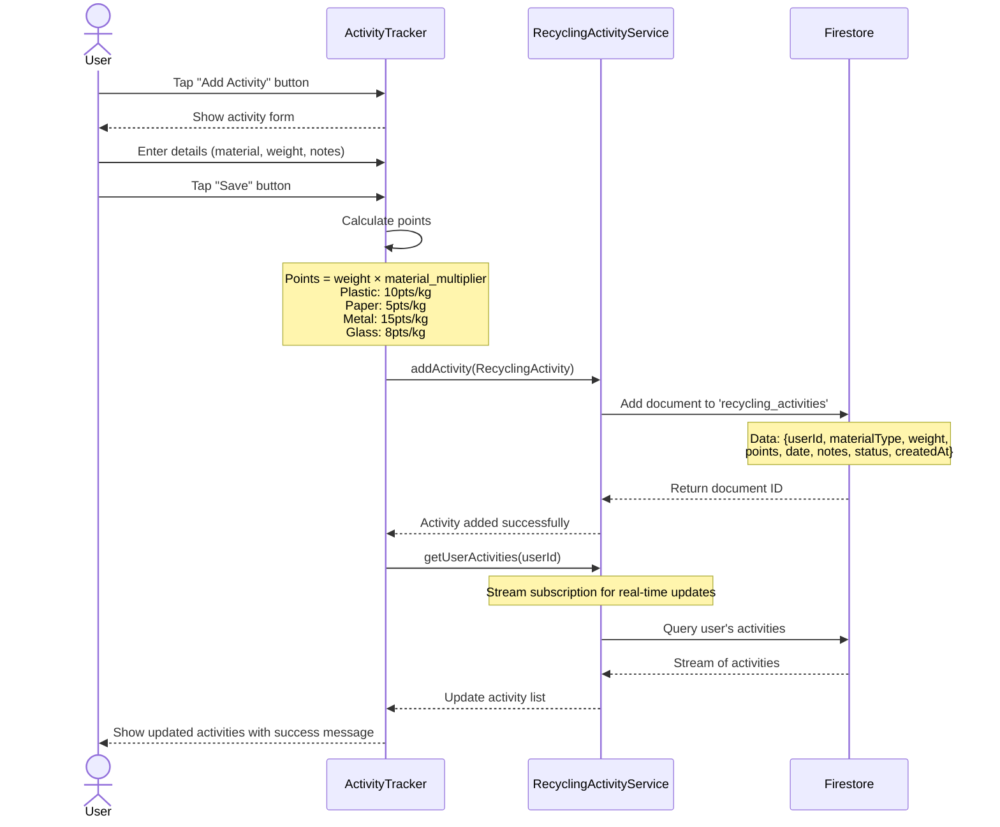
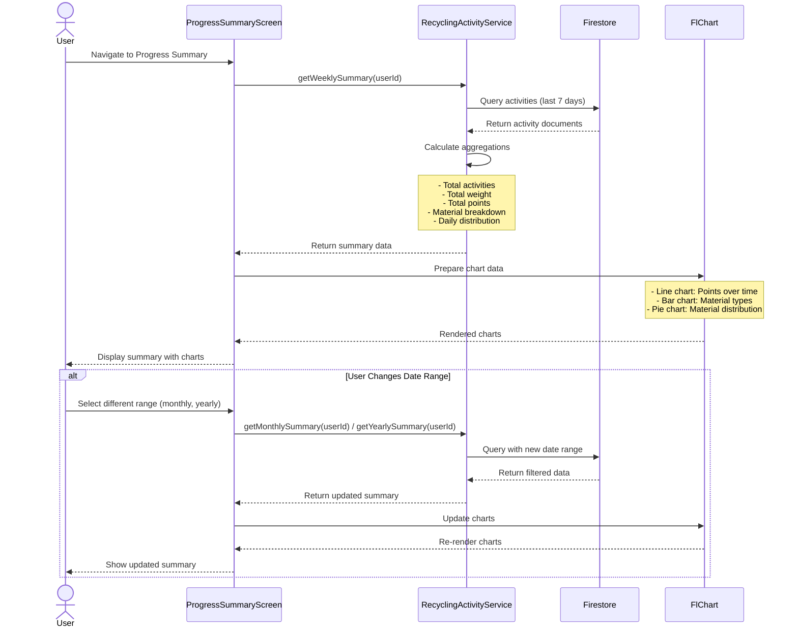
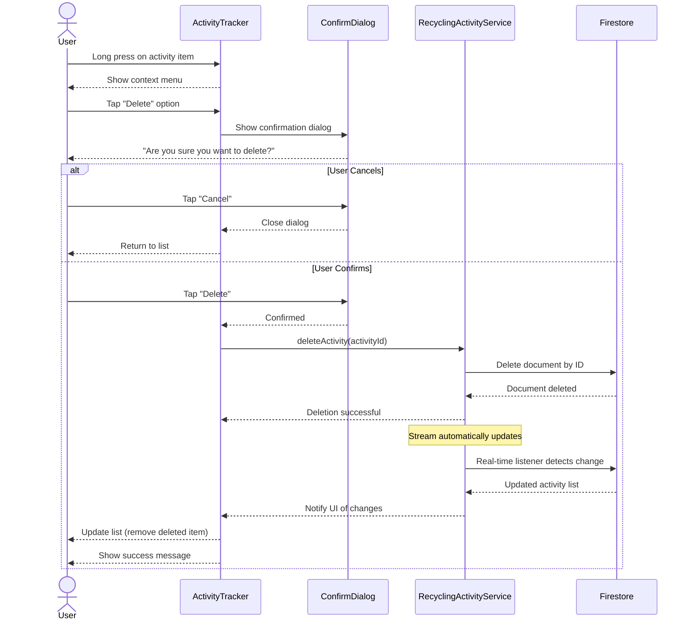
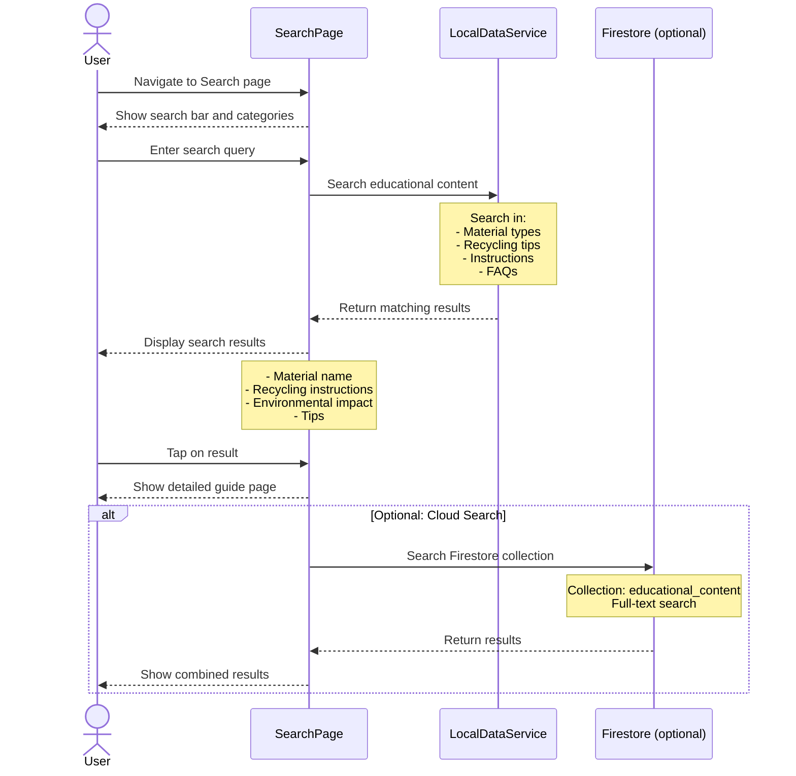
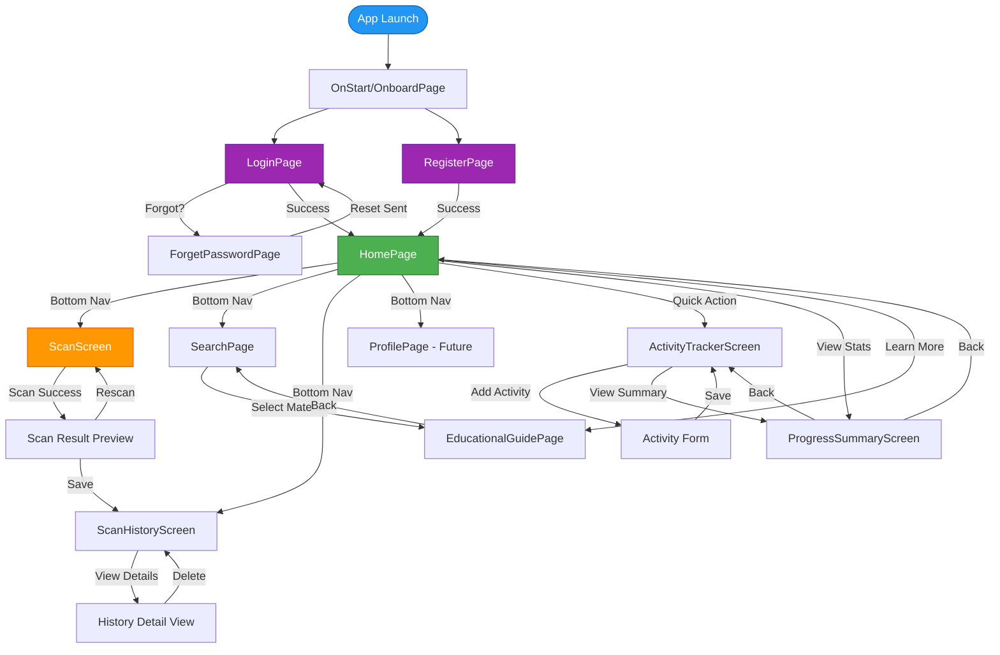

# Green Fn

---

# **RecycleMate – Smart Recycling Helper App**

## **Project Ideation & Initiation**

### **Group Members**

| No. | Name                                 | Matric No. |
| --- | ------------------------------------ | ---------- |
| 1   | AHMAD MUIZZUDDIN BIN AHMAD RIDZUAN   | 2211679    |
| 2   | MUHAMMAD AFIF BIN HUSNAN             | 2212583    |
| 3   | MUHAMMAD AMIR ZARIEFF BIN JEFNEE     | 2216919    |
| 4   | MUHAMMAD AFLAH BIN MOHAMAD ZULKHAIRI | 2217393    |

---


### **Group Members Tasks**

| Member                              | Assigned Tasks                                                                                                                                             |
| ----------------------------------- | ---------------------------------------------------------------------------------------------------------------------------------------------------------- |
| **AHMAD MUIZZUDDIN (2211679)**      | • Firebase User Authentication (Register, Login, Logout)<br>• Authentication UI Screens<br>• Form Validation & Error Handling<br>• User Session Management |
| **MUHAMMAD AFIF (2212583)**         | • Item Scanner using Camera Plugin<br>• Item Classification Logic<br>• Scan Result UI<br>• Firestore CRUD for Scan History                                 |
| **MUHAMMAD AMIR ZARIEFF (2216919)** | • Manual Search Feature<br>• Firestore Query/Search Logic<br>• Search Result UI<br>• Educational Tips & Recycling Guide Section                            |
| **MUHAMMAD AFLAH (2217393)**        | • Recycling Activity Tracker (CRUD)<br>• Weekly/Monthly Progress Summary Screen<br>• Chart/Progress Indicator UI<br>• Firestore Storage for User Logs      |

---

### **Shared Group Tasks (All Members)**

| Shared Tasks                              |
| ----------------------------------------- |
| UI/UX Design (Color theme, logo, layout)  |
| Navigation Flow & Screen Design           |
| GitHub Branching, Merging & Pull Requests |
| Weekly Progress Reporting                 |
| Integration of All Modules                |
| Debugging & Final Testing                 |
| Group Presentation                        |

---

### **Project Details**

1. **Title**
   
   RecycleMate – Smart Recycling Helper App

2. **Background of the Problem**
   
   Although recycling is encouraged worldwide, many adults still struggle to understand what can and cannot be recycled. Items like plastic containers, packaging, paper, and glass are often thrown into the wrong bin due to confusion. Incorrect sorting leads to contamination, making recyclable materials unusable and contributing to higher landfill waste. Adults may want to recycle, but inconsistent rules and lack of clear information make it difficult. A simple mobile app that gives instant guidance can help people recycle correctly and support environmental sustainability.

3. **Purpose / Objective**
   
   RecycleMate aims to help adults make smarter and more environmentally friendly waste disposal decisions. The main objectives are:

   * Identify whether an item is recyclable, non-recyclable, or requires special handling.
   * Provide correct disposal instructions in a simple and clear manner.
   * Educate users with recycling tips and common mistakes to avoid.
   * Encourage consistent recycling habits using a built-in tracking system.
   * Offer a fast and convenient tool that supports sustainable lifestyle choices.

4. **Target Users**
   
   The app is designed for adults aged 18–60, especially:

   * Homeowners
   * Working adults
   * Parents
   * People who manage household waste
   * Anyone who wants clearer recycling information

5. **Preferred Platform**
   **Flutter (Android)** – chosen because:

   * Enables fast UI design with built-in widgets.
   * Integrates well with Firebase Authentication & Cloud Firestore.
   * Supports required packages, plugins, and state management.
   * Cross-platform (Android → iOS future-ready).
   * Matches course requirement to use Flutter + Backend as a Service.

6. **Features and Functionalities**

   a. **User Authentication (Firebase)**

      * Register, login, logout
      * Email/password authentication
      * Form validation & error handling

   b. **Item Scanner & Classification**

      * Use phone camera to scan items
      * Identify item type (plastic, paper, glass, metal, food packaging)
      * Display appropriate disposal instructions

   c. **Manual Search Feature**

      * Search for items using text input
      * Returns correct recycling method
      * Firestore integration for item data

   d. **Recycling Tips & Educational Content**

      * Do’s and don’ts
      * Common recycling mistakes
      * Eco-friendly lifestyle suggestions

   e. **Recycling Activity Tracker**

      * Users log items they recycle
      * Weekly/monthly progress summary
      * Motivational eco-progress charts

   f. **Firebase Firestore Storage (CRUD)**

      * Store user profile, scan history, search history, activity logs
      * All features use Create, Read, Update & Delete operations

   g. **Clean & Consistent UI/UX**

      * Clear icons and labeling
      * Simple navigation layout
      * Consistent color theme and screen structure

**How We Came Up With the App Idea:**

Our group wanted to develop an app that solves a real-world problem while being achievable using Flutter. Recycling confusion is a common issue among adults, leading to incorrect waste management and environmental pollution. RecycleMate helps adults recycle confidently with instant guidance and helpful learning features. The app fits the course requirements because it uses packages, plugins, authentication, backend storage, CRUD operations, and well-structured UI/UX principles. It also provides an opportunity for each group member to implement equally challenging tasks.

---

# Technical Feasibility and Back-End Assessment
## RecycleMate Application

**Date:** February 3, 2026  
**Version:** 1.0  
**Platform:** Flutter (Multi-Platform)

---

## Table of Contents
1. [Executive Summary](#executive-summary)
2. [Technical Feasibility Analysis](#technical-feasibility-analysis)
3. [Back-End Architecture](#back-end-architecture)
4. [Data Storage & CRUD Operations](#data-storage--crud-operations)
5. [Packages and Plugins Assessment](#packages-and-plugins-assessment)
6. [Platform Compatibility Analysis](#platform-compatibility-analysis)
7. [Sequence Diagrams](#sequence-diagrams)
8. [Screen Navigation Flow](#screen-navigation-flow)
9. [Risk Assessment](#risk-assessment)
10. [Recommendations](#recommendations)

---

## 1. Executive Summary

RecycleMate is a cross-platform mobile application built using Flutter framework with Firebase as the backend service. The application enables users to track recycling activities, scan recyclable materials, and earn points for their environmental contributions.

**Key Technical Decisions:**
- **Framework:** Flutter 3.10.1+
- **Backend:** Firebase (Firestore, Authentication)
- **Primary Platforms:** iOS and Android smartphones
- **Secondary Platforms:** Web, Windows, macOS, Linux (with limitations)
- **Wearable Support:** Limited (requires additional development)

---

## 2. Technical Feasibility Analysis

### 2.1 Framework Suitability
**Flutter Framework: HIGHLY FEASIBLE ✅**

| Aspect | Feasibility | Rationale |
|--------|------------|-----------|
| Cross-platform development | Excellent | Single codebase for iOS, Android, Web |
| Performance | Good | Native compilation, 60fps rendering |
| Development speed | Excellent | Hot reload, rich widget library |
| Community support | Excellent | Large ecosystem, mature packages |
| Learning curve | Moderate | Dart language is easy to learn |

### 2.2 Core Features Feasibility

#### ✅ **Implemented Features:**
1. **User Authentication** - Firebase Auth (Email/Password)
2. **Recycling Activity Tracking** - Full CRUD operations
3. **Material Scanning** - Image recognition integration
4. **Points System** - Real-time calculation
5. **Progress Analytics** - Weekly/monthly summaries
6. **Educational Content** - Guide pages

#### ⚠️ **Requires Enhancement:**
1. **Offline Mode** - Limited local caching
2. **Push Notifications** - Not yet implemented
3. **Social Features** - Requires additional development
4. **Wearable Integration** - Requires platform-specific development

---

## 3. Back-End Architecture

### 3.1 Firebase Backend Structure

```
Firebase Services Used:
├── Firebase Core (v3.8.1)
├── Firebase Authentication (v5.3.4)
│   ├── Email/Password authentication
│   └── User session management
└── Cloud Firestore (v5.6.0)
    ├── NoSQL database
    ├── Real-time synchronization
    └── Scalable storage
```

### 3.2 Third-Party Services

```
External APIs:
└── Google Vision API (planned)
    ├── Image recognition
    ├── Barcode/QR code scanning
    └── Material classification
```

### 3.3 Architecture Pattern

**Pattern:** Service-Oriented Architecture (SOA)

```
Application Layer
    ├── Presentation Layer (Pages/Screens)
    ├── Service Layer
    │   ├── RecyclingActivityService
    │   ├── ScanHistoryService
    │   ├── GoogleVisionService
    │   └── ItemClassifier
    ├── Model Layer
    │   ├── RecyclingActivity
    │   └── ScanRecord
    └── Routes (Navigation)
```

---

## 4. Data Storage & CRUD Operations

### 4.1 Database Collections

#### **Collection 1: `recycling_activities`**
Stores user recycling activities and points.

**Schema:**
```json
{
  "id": "auto-generated",
  "userId": "string (user_id reference)",
  "materialType": "string (plastic, paper, metal, glass, etc.)",
  "weight": "double (in KG)",
  "points": "integer",
  "date": "Timestamp",
  "notes": "string (optional)",
  "status": "string (completed, pending, cancelled)",
  "createdAt": "Timestamp"
}
```

**Indexes:**
- `userId` (ascending)
- `date` (descending)
- Composite: `userId + date`

#### **Collection 2: `scan_records`**
Stores scanned item history.

**Schema:**
```json
{
  "id": "auto-generated",
  "userId": "string (user_id reference)",
  "code": "string (barcode/QR code)",
  "materialType": "string",
  "weightKg": "double",
  "points": "integer",
  "instructions": "string (recycling instructions)",
  "createdAt": "Timestamp"
}
```

**Indexes:**
- `userId` (ascending)
- `createdAt` (descending)

#### **Collection 3: `users` (Managed by Firebase Auth)**
User profile and authentication data.

**Schema:**
```json
{
  "uid": "auto-generated",
  "email": "string",
  "displayName": "string (optional)",
  "totalPoints": "integer",
  "createdAt": "Timestamp",
  "lastActivity": "Timestamp"
}
```

### 4.2 CRUD Operations Implementation

#### **CREATE Operations**

**Service:** `RecyclingActivityService`

```dart
Future<String> addActivity(RecyclingActivity activity) async {
  try {
    DocumentReference docRef = await _collection.add(activity.toMap());
    return docRef.id; // Returns document ID
  } catch (e) {
    throw Exception('Failed to add activity: $e');
  }
}
```

**Usage Scenario:**
- When user logs a new recycling activity
- When user scans a recyclable item
- Points automatically calculated and stored

---

#### **READ Operations**

**1. Stream-based Real-time Reading:**
```dart
Stream<List<RecyclingActivity>> getUserActivities(String userId) {
  return _collection
      .where('userId', isEqualTo: userId)
      .orderBy('date', descending: true)
      .snapshots()
      .map((snapshot) => snapshot.docs
          .map((doc) => RecyclingActivity.fromFirestore(doc))
          .toList());
}
```

**2. One-time Reading:**
```dart
Future<RecyclingActivity?> getActivityById(String activityId) async {
  DocumentSnapshot doc = await _collection.doc(activityId).get();
  if (doc.exists) {
    return RecyclingActivity.fromFirestore(doc);
  }
  return null;
}
```

**3. Filtered Reading (Date Range):**
```dart
Stream<List<RecyclingActivity>> getActivitiesByDateRange(
  String userId,
  DateTime startDate,
  DateTime endDate,
) {
  return _collection
      .where('userId', isEqualTo: userId)
      .where('date', isGreaterThanOrEqualTo: Timestamp.fromDate(startDate))
      .where('date', isLessThanOrEqualTo: Timestamp.fromDate(endDate))
      .orderBy('date', descending: true)
      .snapshots()
      .map((snapshot) => snapshot.docs
          .map((doc) => RecyclingActivity.fromFirestore(doc))
          .toList());
}
```

---

#### **UPDATE Operations**

```dart
Future<void> updateActivity(RecyclingActivity activity) async {
  try {
    await _collection.doc(activity.id).update(activity.toMap());
  } catch (e) {
    throw Exception('Failed to update activity: $e');
  }
}
```

**Usage Scenarios:**
- Editing activity details (weight, notes)
- Changing activity status (completed → cancelled)
- Updating points after recalculation

---

#### **DELETE Operations**

```dart
Future<void> deleteActivity(String activityId) async {
  try {
    await _collection.doc(activityId).delete();
  } catch (e) {
    throw Exception('Failed to delete activity: $e');
  }
}
```

**Usage Scenarios:**
- User deletes incorrect entry
- Admin removes fraudulent activities
- Data retention policy cleanup

---

### 4.3 Data Aggregation & Analytics

**Weekly Summary Calculation:**
```dart
Future<Map<String, dynamic>> getWeeklySummary(String userId) async {
  DateTime now = DateTime.now();
  int daysFromSunday = now.weekday % 7;
  DateTime startDate = DateTime(now.year, now.month, now.day)
      .subtract(Duration(days: daysFromSunday));
  DateTime endDate = startDate.add(Duration(days: 6, hours: 23, minutes: 59));
  
  QuerySnapshot snapshot = await _collection
      .where('userId', isEqualTo: userId)
      .where('date', isGreaterThanOrEqualTo: Timestamp.fromDate(startDate))
      .where('date', isLessThanOrEqualTo: Timestamp.fromDate(endDate))
      .get();
  
  // Process and return aggregated data
  return {
    'totalActivities': snapshot.docs.length,
    'totalWeight': calculateTotalWeight(snapshot),
    'totalPoints': calculateTotalPoints(snapshot),
    'materialBreakdown': getMaterialBreakdown(snapshot),
  };
}
```

---

## 5. Packages and Plugins Assessment

### 5.1 Core Dependencies

| Package | Version | Purpose | Stability | Wearable Support |
|---------|---------|---------|-----------|------------------|
| **flutter** | SDK | Framework core | Stable | ✅ |
| **firebase_core** | 3.8.1 | Firebase initialization | Stable | ✅ |
| **firebase_auth** | 5.3.4 | User authentication | Stable | ✅ |
| **cloud_firestore** | 5.6.0 | NoSQL database | Stable | ✅ |
| **cupertino_icons** | 1.0.8 | iOS-style icons | Stable | ✅ |
| **email_validator** | 3.0.0 | Email validation | Stable | ✅ |
| **http** | 1.1.0 | HTTP requests | Stable | ✅ |
| **image_picker** | 1.0.4 | Camera/gallery access | Stable | ⚠️ Limited |
| **intl** | 0.20.2 | Internationalization | Stable | ✅ |
| **fl_chart** | 1.1.1 | Data visualization | Stable | ⚠️ Limited |

### 5.2 Package Analysis

#### ✅ **Excellent Choices**

**1. Firebase Suite**
- **Pros:**
  - Real-time synchronization
  - Automatic scaling
  - Built-in security rules
  - Offline persistence support
  - No server management required
- **Cons:**
  - Vendor lock-in
  - Costs increase with usage
  - Limited complex queries
- **Smartphone Compatibility:** Excellent
- **Wearable Compatibility:** Good (with limitations)

**2. image_picker (v1.0.4)**
- **Pros:**
  - Cross-platform (iOS, Android, Web)
  - Simple API
  - Gallery and camera support
- **Cons:**
  - Limited customization
  - Large file sizes on some devices
- **Smartphone Compatibility:** Excellent
- **Wearable Compatibility:** Limited (most wearables lack cameras)

**3. fl_chart (v1.1.1)**
- **Pros:**
  - Beautiful charts
  - Customizable
  - Good performance
- **Cons:**
  - Small screen challenges
  - Complex API for advanced charts
- **Smartphone Compatibility:** Excellent
- **Wearable Compatibility:** Poor (limited screen real estate)

### 5.3 Recommended Additional Packages

#### **For Enhanced Functionality:**

```yaml
dependencies:
  # Already included packages...
  
  # RECOMMENDED ADDITIONS:
  
  # Push Notifications
  firebase_messaging: ^15.1.7
  flutter_local_notifications: ^18.0.1
  
  # State Management
  provider: ^6.1.2
  # or
  riverpod: ^2.6.1
  
  # Local Storage (Offline Support)
  sqflite: ^2.4.1
  hive: ^2.2.3
  shared_preferences: ^2.3.5
  
  # Enhanced Image Processing
  image: ^4.3.0
  
  # QR/Barcode Scanning
  mobile_scanner: ^6.0.2
  
  # Connectivity Status
  connectivity_plus: ^6.1.2
  
  # Location Services (for recycling centers)
  geolocator: ^13.0.2
  google_maps_flutter: ^2.10.0
  
  # Analytics
  firebase_analytics: ^11.4.0
  
  # Wearable Support
  wear: ^1.1.0  # For Wear OS
  health: ^11.1.0  # For health data integration
  
  # UI Enhancements
  shimmer: ^3.0.0  # Loading placeholders
  cached_network_image: ^3.4.1
  lottie: ^3.2.1  # Animations
```

---

## 6. Platform Compatibility Analysis

### 6.1 Smartphone Compatibility

#### **Android Smartphones** ✅ **EXCELLENT**

| Aspect | Compatibility | Notes |
|--------|---------------|-------|
| Minimum SDK | API 21 (Lollipop 5.0) | Covers 99%+ devices |
| Camera Access | Full support | All features work |
| Firebase | Native support | Optimal performance |
| Screen Sizes | Responsive | 4.5" to 7" tablets |
| Performance | Excellent | Native compilation |

**Configuration:** `android/app/build.gradle.kts`
```kotlin
android {
    compileSdk = 34
    defaultConfig {
        minSdk = 21
        targetSdk = 34
    }
}
```

#### **iOS Smartphones** ✅ **EXCELLENT**

| Aspect | Compatibility | Notes |
|--------|---------------|-------|
| Minimum Version | iOS 12.0+ | Covers 95%+ devices |
| Camera Access | Full support | All features work |
| Firebase | Native support | Optimal performance |
| Screen Sizes | Responsive | iPhone SE to Pro Max |
| Performance | Excellent | Native compilation |

**Configuration:** `ios/Podfile`
```ruby
platform :ios, '12.0'
```

### 6.2 Wearable Compatibility

#### **Wear OS (Android Watches)** ⚠️ **PARTIAL SUPPORT**

| Feature | Compatibility | Implementation Required |
|---------|---------------|------------------------|
| View Progress | ✅ Possible | Simplified UI needed |
| Track Activities | ✅ Possible | Manual entry only |
| Scan Items | ❌ Limited | Most lack cameras |
| Charts/Analytics | ⚠️ Limited | Small screen constraints |
| Notifications | ✅ Good | Push notifications work |

**Required Changes:**
1. Create separate wearable module
2. Use Wear OS-specific widgets
3. Implement companion app pattern
4. Simplify navigation (max 2-3 taps)

```yaml
# Additional dependency for Wear OS
dependencies:
  wear: ^1.1.0
```

#### **Apple Watch (watchOS)** ⚠️ **PARTIAL SUPPORT**

| Feature | Compatibility | Implementation Required |
|---------|---------------|------------------------|
| View Progress | ✅ Possible | SwiftUI companion app |
| Track Activities | ✅ Possible | Manual entry only |
| Scan Items | ❌ Not possible | No camera API |
| Charts/Analytics | ⚠️ Limited | Small screen constraints |
| Notifications | ✅ Good | Native support |

**Required Changes:**
1. Develop native watchOS app in SwiftUI
2. Implement Watch Connectivity
3. Sync data with iPhone app
4. Use Complications for quick view

**Note:** Flutter does not directly support watchOS. Native development required.

### 6.3 Other Platforms

#### **Web** ⚠️ **PARTIAL SUPPORT**
- Camera access requires WebRTC
- Firebase works well
- Progressive Web App (PWA) possible
- Not ideal for primary use case

#### **Desktop (Windows/macOS/Linux)** ⚠️ **LIMITED**
- No camera access on many devices
- Firebase works
- Not suitable for primary use case

---

## 7. Sequence Diagrams

### 7.1 User Registration Flow



### 7.2 User Login Flow



### 7.3 Scan Item Flow



### 7.4 Add Recycling Activity Flow



### 7.5 View Progress Summary Flow



### 7.6 Delete Activity Flow



### 7.7 Search Educational Content Flow



---

## 8. Screen Navigation Flow

### 8.1 Complete Navigation Diagram



### 8.2 Navigation Routes Configuration

**Routes Definition:** `lib/services/routes.dart`

```dart
class Routes {
  // Authentication Routes
  static const String onStart = '/';
  static const String loginPage = '/login';
  static const String registerPage = '/register';
  static const String forgetPassword = '/forget-password';
  
  // Main App Routes
  static const String homePageDummy = '/home';
  static const String scanScreen = '/scan';
  static const String scanHistoryScreen = '/scan-history';
  static const String searchPage = '/search';
  static const String educationalGuide = '/educational-guide';
  static const String activityTracker = '/activity-tracker';
  static const String progressSummary = '/progress-summary';
  
  // Future Routes (Recommended)
  static const String profilePage = '/profile';
  static const String settingsPage = '/settings';
  static const String leaderboardPage = '/leaderboard';
  static const String rewardsPage = '/rewards';
  static const String notificationsPage = '/notifications';
}
```

### 8.3 Bottom Navigation Structure

**HomePage Bottom Navigation:**

```
┌─────────────────────────────────────────┐
│           RecycleMate                    │
├─────────────────────────────────────────┤
│                                          │
│         [Main Content Area]              │
│                                          │
│                                          │
├─────────────────────────────────────────┤
│  [Home]  [Scan]  [Search]  [History]   │
└─────────────────────────────────────────┘
```

**Navigation Items:**
1. **Home** (`/home`) - Dashboard with quick stats
2. **Scan** (`/scan`) - Camera/scanner interface
3. **Search** (`/search`) - Material search and guides
4. **History** (`/scan-history`) - Past scan records

### 8.4 User Journey Flows

#### **First-Time User Journey**
```
App Launch → Onboarding → Register → HomePage → 
Tutorial Overlay → First Scan → Success Message → 
View History → Explore Educational Content
```

#### **Returning User Journey**
```
App Launch → Auto-Login → HomePage → 
[Choose Action]:
├─ Quick Scan → Result → Save → History
├─ View Progress → Analytics Dashboard
├─ Add Manual Activity → Activity Tracker
└─ Learn Materials → Search → Educational Guide
```

#### **Activity Tracking Journey**
```
HomePage → Activity Tracker → Add Activity → 
Fill Form (Material Type, Weight, Notes) → 
Calculate Points → Save → View Updated List → 
View Progress Summary → See Charts
```

### 8.5 Navigation Patterns

#### **Pattern 1: Stack Navigation**
Used for linear flows where users move forward and back.

```
LoginPage → HomePage → ActivityTracker → ActivityForm
   ↑                                          ↓
   └──────────────── Back ←──────────────────┘
```

#### **Pattern 2: Tab Navigation**
Used for switching between main sections.

```
    ┌─────┬─────┬─────┬─────┐
    │Home │Scan │Search│History│
    └─────┴─────┴─────┴─────┘
```

#### **Pattern 3: Modal Navigation**
Used for temporary overlays and forms.

```
HomePage
    ↓ (Tap Floating Action Button)
[─────────────────]
│  Add Activity   │ ← Modal Sheet
│  [Form Fields]  │
[─────────────────]
    ↓ (Save/Cancel)
HomePage (Updated)
```

### 8.6 Deep Linking Structure (Future Enhancement)

```
recyclemate://
├── auth/
│   ├── login
│   └── register
├── scan/
│   └── [scan_id]
├── activity/
│   └── [activity_id]
├── guide/
│   └── [material_type]
└── profile/
    └── [user_id]
```

---

## 9. Risk Assessment

### 9.1 Technical Risks

| Risk | Severity | Likelihood | Mitigation |
|------|----------|------------|------------|
| **Firebase Costs** | High | Medium | Implement data caching, query optimization |
| **Offline Functionality** | Medium | High | Add local database (Hive/SQLite) |
| **Google Vision API Limits** | High | Medium | Cache results, implement rate limiting |
| **Image Processing Performance** | Medium | Medium | Compress images, optimize processing |
| **Wearable Integration Complexity** | High | Low | Start with notifications only, phase approach |
| **Camera Access Issues** | Low | Low | Proper permission handling, fallback options |
| **Data Synchronization Conflicts** | Medium | Low | Use Firestore transactions, conflict resolution |

### 9.2 Platform-Specific Risks

#### **Android**
- ⚠️ Fragmentation: 1000+ device types
- ⚠️ Permission denials: Backup camera option needed
- ✅ Good: Excellent Flutter support

#### **iOS**
- ⚠️ App Store Review: Requires privacy policy
- ⚠️ Background restrictions: Limited background processing
- ✅ Good: Consistent hardware

#### **Wearables**
- ❌ High: Limited camera support
- ❌ High: Small screen UI challenges
- ❌ High: Battery constraints

---

## 10. Recommendations

### 10.1 Immediate Priorities (Phase 1)

#### **1. Enhance Data Management**
```yaml
# Add to pubspec.yaml
dependencies:
  provider: ^6.1.2  # State management
  hive: ^2.2.3      # Local storage
  hive_flutter: ^1.1.0
```

**Implementation:**
- Add Provider for state management
- Implement Hive for offline data caching
- Add data synchronization logic

#### **2. Improve User Experience**
```yaml
dependencies:
  shimmer: ^3.0.0              # Loading effects
  cached_network_image: ^3.4.1 # Image caching
  flutter_local_notifications: ^18.0.1  # Local alerts
```

#### **3. Add Analytics**
```yaml
dependencies:
  firebase_analytics: ^11.4.0
  firebase_crashlytics: ^4.2.0
```

### 10.2 Short-term Enhancements (Phase 2)

#### **1. QR/Barcode Scanning**
```yaml
dependencies:
  mobile_scanner: ^6.0.2
```

#### **2. Push Notifications**
```yaml
dependencies:
  firebase_messaging: ^15.1.7
```

#### **3. Location Services**
```yaml
dependencies:
  geolocator: ^13.0.2
  google_maps_flutter: ^2.10.0
```

**Use Case:** Show nearby recycling centers

### 10.3 Long-term Goals (Phase 3)

#### **1. Wearable Support**

**Wear OS Implementation:**
```yaml
dependencies:
  wear: ^1.1.0
```

**Features:**
- View total points
- Quick manual entry
- Daily progress notifications
- Complications (watch face widgets)

**Apple Watch Implementation:**
- Native watchOS app in SwiftUI
- HealthKit integration
- Activity rings for recycling goals

#### **2. Social Features**
```yaml
dependencies:
  share_plus: ^10.1.4
  url_launcher: ^6.3.3
```

**Features:**
- Leaderboards
- Share achievements
- Community challenges

#### **3. Gamification**
- Achievements/badges system
- Streak tracking
- Rewards/coupons integration

### 10.4 Database Optimization

#### **Firestore Indexes (Required)**

Create composite indexes for common queries:

```javascript
// Index 1: User activities by date
{
  collectionGroup: "recycling_activities",
  queryScope: "COLLECTION",
  fields: [
    { fieldPath: "userId", order: "ASCENDING" },
    { fieldPath: "date", order: "DESCENDING" }
  ]
}

// Index 2: Material type aggregation
{
  collectionGroup: "recycling_activities",
  queryScope: "COLLECTION",
  fields: [
    { fieldPath: "userId", order: "ASCENDING" },
    { fieldPath: "materialType", order: "ASCENDING" },
    { fieldPath: "date", order: "DESCENDING" }
  ]
}

// Index 3: Scan history
{
  collectionGroup: "scan_records",
  queryScope: "COLLECTION",
  fields: [
    { fieldPath: "userId", order: "ASCENDING" },
    { fieldPath: "createdAt", order: "DESCENDING" }
  ]
}
```

#### **Security Rules**

```javascript
rules_version = '2';
service cloud.firestore {
  match /databases/{database}/documents {
    
    // Users can only read/write their own data
    match /recycling_activities/{activityId} {
      allow read, write: if request.auth != null && 
                          request.auth.uid == resource.data.userId;
      allow create: if request.auth != null && 
                      request.auth.uid == request.resource.data.userId;
    }
    
    match /scan_records/{recordId} {
      allow read, write: if request.auth != null && 
                          request.auth.uid == resource.data.userId;
      allow create: if request.auth != null && 
                      request.auth.uid == request.resource.data.userId;
    }
    
    // Users collection
    match /users/{userId} {
      allow read: if request.auth != null;
      allow write: if request.auth != null && request.auth.uid == userId;
    }
  }
}
```

### 10.5 Testing Strategy

#### **Unit Tests**
```dart
// test/services/recycling_activity_service_test.dart
void main() {
  group('RecyclingActivityService', () {
    test('Calculate points correctly', () {
      // Test points calculation logic
    });
    
    test('Date range filtering', () {
      // Test date range queries
    });
  });
}
```

#### **Widget Tests**
```dart
// test/pages/scan_screen_test.dart
void main() {
  testWidgets('Scan button triggers camera', (WidgetTester tester) async {
    await tester.pumpWidget(MyApp());
    // Test UI interactions
  });
}
```

#### **Integration Tests**
```dart
// integration_test/app_test.dart
void main() {
  testWidgets('Complete user flow', (WidgetTester tester) async {
    // Test: Login → Scan → Save → View History
  });
}
```

---

## Conclusion

### Technical Feasibility: ✅ **HIGHLY FEASIBLE**

RecycleMate's technical architecture is **sound and production-ready** for smartphone platforms (iOS and Android). The chosen technology stack (Flutter + Firebase) provides excellent scalability, cross-platform compatibility, and rapid development capabilities.

### Key Strengths:
1. ✅ **Robust Backend:** Firebase provides reliable, scalable infrastructure
2. ✅ **Complete CRUD Operations:** Well-implemented data management
3. ✅ **Modern Architecture:** Clean separation of concerns (Services, Models, UI)
4. ✅ **Good Package Selection:** Stable, well-maintained dependencies
5. ✅ **Smartphone Ready:** Excellent compatibility with iOS and Android

### Areas Requiring Attention:
1. ⚠️ **Wearable Support:** Requires significant additional development
2. ⚠️ **Offline Mode:** Needs local database implementation
3. ⚠️ **State Management:** Consider adding Provider/Riverpod
4. ⚠️ **Cost Management:** Monitor Firebase usage and implement optimizations
5. ⚠️ **Testing:** Increase test coverage

### Wearable Compatibility Assessment:
- **Wear OS:** Partial support possible with significant effort (Estimate: 2-3 months development)
- **Apple Watch:** Requires native development (Estimate: 3-4 months development)
- **Recommendation:** Focus on smartphone experience first, add wearable support in Phase 3

### Final Recommendation:
**Proceed with smartphone-first approach.** The app is technically feasible and ready for production deployment on iOS and Android. Wearable support should be considered a long-term enhancement rather than an initial requirement.

---

**Document Version:** 1.0  
**Last Updated:** February 3, 2026  
**Status:** ✅ Ready for Implementation


